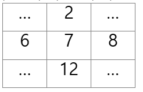

5x5 2차 배열에 무작위로 25개의 숫자로 초기화 한 후 
25개의 각 요소에 대해서 그 요소와 이웃한 요소와의 차의 절대값을 구하시오.
예를 들어 아래 그림에서 7 값의 이웃한 값은 2, 6, 8, 12 이며 차의 절대값의 합은 12 이다.
| 2 – 7 | + | 6 – 7 | + | 8 – 7 | + | 12 – 7 | = 12

25개의 요소에 대해서 모두 조사하여 총합을 구하시오.
벽에 있는 요소는 이웃한 요소가 없을 수 있음을 주의하시오.
예를 들어 [0][0]은 이웃한 요소가 2개이다.
 