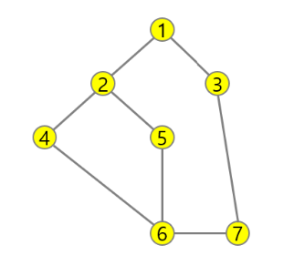

* 다음은 연결되어 있는 두 개의 정점 사이의 간선을 순서대로 나열 해 놓은 것이다. 모든 정점을 깊이 우선 탐색하여 화면에 깊이 우선 탐색 경로를 출력하시오. 시작 정점을 1로 시작하시오.
* 정점 탐색시 숫자가 낮은 정점부터 방문한다.

* 입력
총 테스트 갯수는 1개이며,
첫 줄은 정점의 개수(V)와 간선의 개수(E)이 주어지고,
그 다음 줄부터 간선의 개수 만큼 연결된 두 정점이 주어진다.

7 8
1 2 1 3 2 4 2 5 4 6 5 6 6 7 3 7

* 출력 결과의 예는 다음과 같다.
#1 1-2-4-6-5-7-3