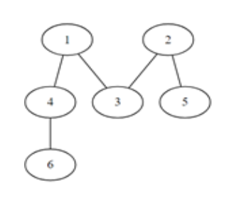

V개의 노드 개수와 방향성이 없는 E개의 간선 정보가 주어진다.

주어진 출발 노드에서 최소 몇 개의 간선을 지나면 도착 노드에 갈 수 있는지 알아내는 프로그램을 만드시오.

예를 들어 다음과 같은 그래프에서 1에서 6으로 가는 경우, 두 개의 간선을 지나면 되므로 2를 출력한다.

노드 번호는 1번부터 존재하며, 노드 중에는 간선으로 연결되지 않은 경우도 있을 수 있다.

[입력]

첫 줄에 테스트 케이스 개수 T가 주어진다.  1<=T<=50

다음 줄부터 테스트 케이스의 첫 줄에 V와 E가 주어진다. 5<=V=50, 4<=E<=1000

테스트케이스의 둘째 줄부터 E개의 줄에 걸쳐, 간선의 양쪽 노드 번호가 주어진다.

E개의 줄 이후에는 출발 노드 S와 도착 노드 G가 주어진다.

[출력]

각 줄마다 "#T" (T는 테스트 케이스 번호)를 출력한 뒤, 답을 출력한다.

두 노드 S와 G가 서로 연결되어 있지 않다면, 0을 출력한다.