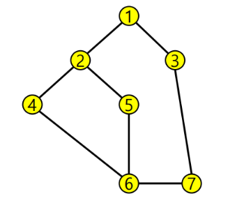

다음은 연결되어 있는 두 개의 정점 사이의 간선을 순서대로 나열 해놓은 것이다.
모든 정점을 너비우선탐색 하여 경로를 출력하시오.
시작 정점을 1로 시작하시오.

[ 입력 ] 
첫 줄은 정점의 개수 V와 간선의 개수 E가 주어진다.
다음 줄 부터 간선의 정보가 쌍으로 주어진다. 
7 8
1 2 1 3 2 4 2 5 4 6 5 6 6 7 3 7

출력
#1 1 2 3 4 5 7 6