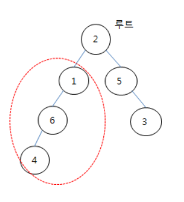

트리의 일부를 서브 트리라고 한다. 주어진 이진 트리에서 노드 N을 루트로 하는 서브 트리에 속한 노드의 개수를 알아내는 프로그램을 만드시오.

주어지는 트리는 부모와 자식 노드 번호 사이에 특별한 규칙이 없고, 부모가 없는 노드가 전체의 루트 노드가 된다.

이런 경우의 트리는 부모 노드를 인덱스로 다음과 같은 방법으로 나타낼 수 있다. 자식 노드가 0인 경우는 노드가 자식이 없는 경우이다.

[입력]

첫 줄에 테스트케이스의 수 T가 주어진다. 1<=T<=50

다음 줄부터 테스트 케이스의 별로 첫 줄에 간선의 개수 E와 N이 주어지고, 다음 줄에 E개의 부모 자식 노드 번호 쌍이 주어진다.

노드 번호는 1번부터 E+1번까지 존재한다. 1<=E<=1000, 1<=N<=E+1

[출력]

각 줄마다 "#T" (T는 테스트 케이스 번호)를 출력한 뒤, 답을 출력한다.
