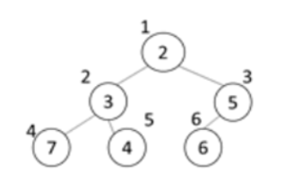

이진 최소힙은 다음과 같은 특징을 가진다.

    - 항상 완전 이진 트리를 유지하기 위해 마지막 노드 뒤에 새 노드를 추가한다.

    - 부모 노드의 값<자식 노드의 값을 유지한다. 새로 추가된 노드의 값이 조건에 맞지 않는 경우, 조건을 만족할 때까지 부모 노드와 값을 바꾼다.

    - 노드 번호는 루트가 1번, 왼쪽에서 오른쪽으로, 더 이상 오른쪽이 없는 경우 다음 줄로 1씩 증가한다.

예를 들어 7, 2, 5, 3, 4, 6이 차례로 입력되면 다음과 같은 트리가 구성된다.

이때 마지막 노드인 6번의 조상은 3번과 1번 노드이다.

1000000이하인 N개의 서로 다른 자연수가 주어지면 입력 순서대로 이진 최소힙에 저장하고, 마지막 노드의 조상 노드에 저장된 정수의 합을 알아내는 프로그램을 작성하시오.

[입력]

첫 줄에 테스트케이스의 수 T가 주어진다. 1<=T<=50
다음 줄부터 테스트 케이스의 별로 N이 주어지고, 다음 줄에 1000000이하인 서로 다른 N개의 자연수가 주어진다. 5<=N<=500

[출력]

각 줄마다 "#T" (T는 테스트 케이스 번호)를 출력한 뒤, 답을 출력한다.