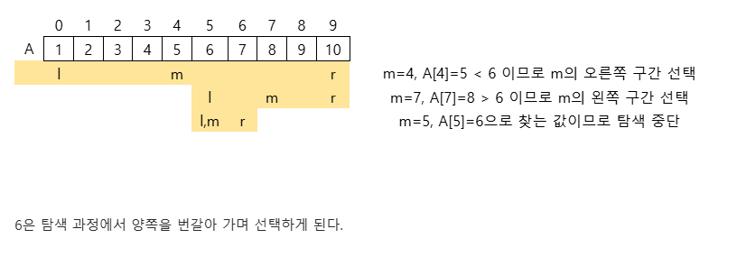

서로 다른 정수 N개가 주어지면 정렬한 상태로 리스트 A에 저장한다. 그런 다음 리스트 B에 저장된 M개의 정수에 대해 A에 들어있는 수인지 이진 탐색을 통해 확인하려고 한다.

전체 탐색 구간의 시작과 끝 인덱스를 l과 r이라고 하면, 중심 원소의 인덱스 m=(l+r)//2 이고, 이진 탐색의 왼쪽 구간은 l부터 m-1, 오른쪽 구간은 m+1부터 r이 된다.

이때 B에 속한 어떤 수가 A에 들어있으면서, 동시에 탐색 과정에서 양쪽구간을 번갈아 선택하게 되는 숫자의 개수를 알아보려고 한다.

다음은 10개의 정수가 저장된 리스트 A에서 이진 탐색으로 6을 찾는 예이다.

예를 들어 10을 찾는 경우 오른쪽-오른쪽 구간을 선택하므로 조건에 맞지 않는다

5를 찾는 경우 m에 위치하므로 조건에 맞는다.

이때 m에 찾는 원소가 있는 경우 방향을 따지지 않는다. M개의 정수 중 조건을 만족하는 정수의 개수를 알아내는 프로그램을 만드시오.

[입력]

첫 줄에 테스트케이스의 수 T가 주어진다. 1<=T<=50

다음 줄부터 테스트 케이스의 별로 A와 B에 속한 정수의 개수 N, M이 주어지고, 두 줄에 걸쳐 N개와 M개의 백만 이하의 양의 정수가 주어진다.

1<=N, M<=500,000

[출력]

각 줄마다 "#T" (T는 테스트 케이스 번호)를 출력한 뒤, 답을 출력한다.