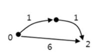

A도시에는 E개의 일방통행 도로 구간이 있으며, 각 구간이 만나는 연결지점에는 0부터 N번까지의 번호가 붙어있다.

구간의 시작과 끝의 연결 지점 번호, 구간의 길이가 주어질 때, 0번 지점에서 N번 지점까지 이동하는데 걸리는 최소한의 거리가 얼마인지 출력하는 프로그램을 만드시오.

모든 연결 지점을 거쳐가야 하는 것은 아니다.

그림은 입력인 N=2, E=3, 시작과 끝 지점, 구간 거리가 아래와 같은 경우의 예이다.

0 1 1
0 2 6
1 2 1

[입력]

첫 줄에 테스트 케이스의 개수 T가 주어지고, 테스트 케이스 별로 첫 줄에 마지막 연결지점 번호N과 도로의 개수 E가 주어진다.

다음 줄부터 E개의 줄에 걸쳐 구간 시작 s, 구간의 끝 지점 e, 구간 거리 w가 차례로 주어진다. ( 1<=T<=50, 1<=N, s, e<=1000, 1<=w<=10, 1<=E<=1000000 )

[출력]

각 줄마다 "#T" (T는 테스트 케이스 번호)를 출력한 뒤, 테스트 케이스에 대한 답을 출력한다.

